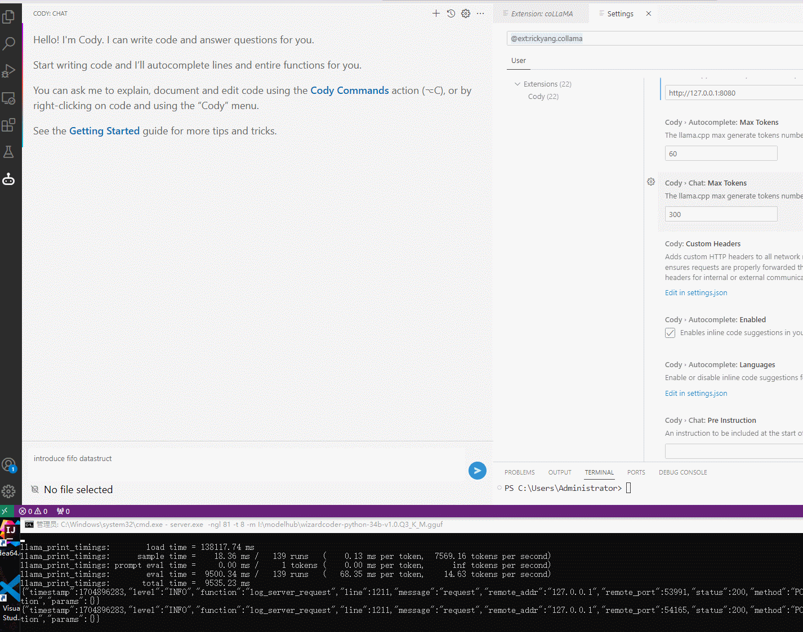
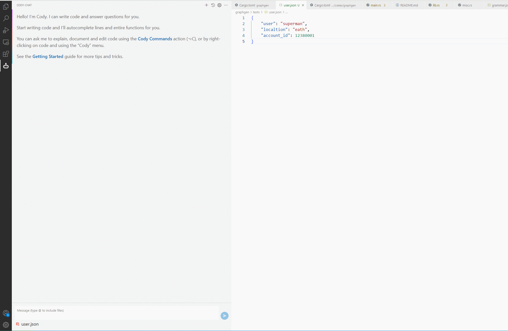
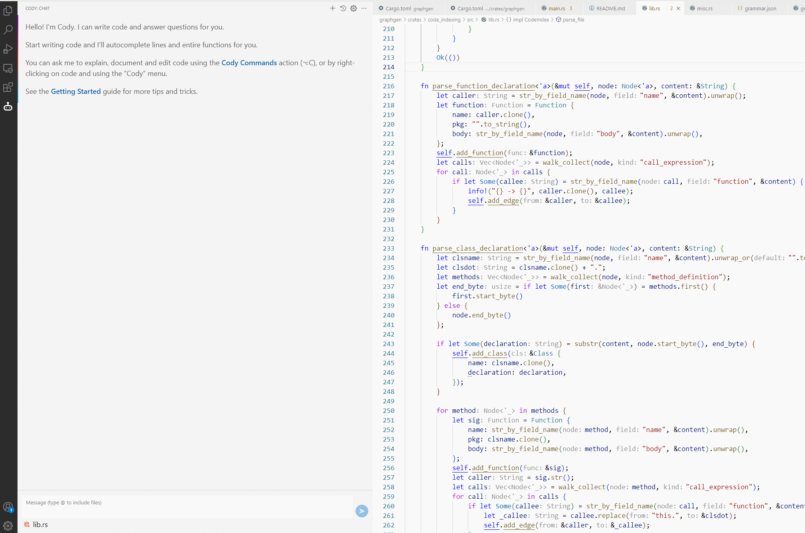

<div align=center>

# AI Copilot with [LLaMA.cpp](https://github.com/ggerganov/llama.cpp)

"VSCode AI coding assistant powered by self-hosted llama.cpp endpoint."

</div>

## Get started

- Install `Open Copilot` from VSCode marketplace.
- Set your llama.cpp server's address like http://192.168.0.101:8080 in the Cody>llama Server Endpoint configure.
- Now enjoy coding with your localized deploy models.

 ### chat 



### code generate



### code explain




## Quick start your model service

### Windows
>
1. Download llama.cpp binary release [archive](https://github.com/ggerganov/llama.cpp/releases)

2. Unzip `llama-bxxx-bin-win-cublas-cuxx.x.x-x64.zip` to folder

3. Download GGUF model file, for example: [wizardcoder-python-13b-v1.0.Q4_K_M.gguf](https://huggingface.co/TheBloke/WizardCoder-Python-13B-V1.0-GGUF/resolve/main/wizardcoder-python-13b-v1.0.Q4_K_M.gguf?download=true)

4. Execute `server.exe` startup command.

```sh
# only use cpu
D:\path_to_unzip_files\server.exe -m D:\path_to_model\wizardcoder-python-13b-v1.0.Q4_K_M.gguf -t 8 -c 1024
# use gpu
D:\path_to_unzip_files\server.exe -m D:\path_to_model\wizardcoder-python-13b-v1.0.Q4_K_M.gguf -t 8 -ngl 81 -c 1024
```


### Linux or MacOS

`Please compile the llama.cpp project by yourself, and follow the same startup steps.`

## Contributing

All code in this repository is open source (Apache 2).

Quickstart: `pnpm install && cd vscode && pnpm run dev` to run a local build of the Cody VS Code extension.

